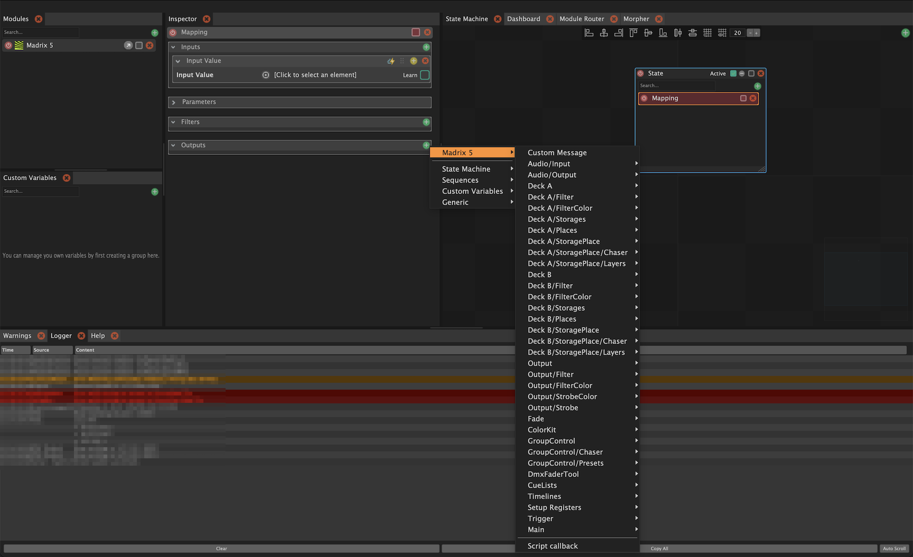
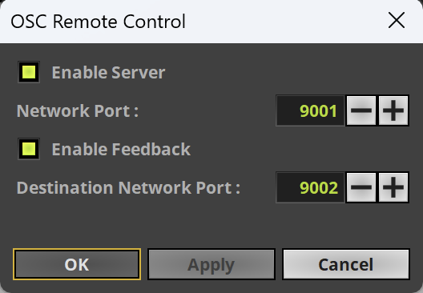
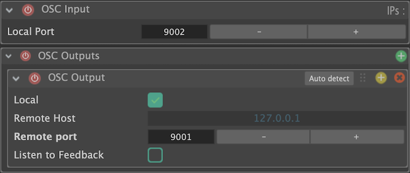

# Madrix5-Chataigne-module

This is a [Chataigne](https://benjamin.kuperberg.fr/chataigne) custom module that allows the control of Madrix 5 via OSC.

To use this module, until it will be available among the [Community Modules](https://github.com/benkuper/Chataigne-community-modules/blob/main/modules.json), clone this repo or download/unzip it in `~/Documents/Chataigne/modules`.

## Madrix 5 configuration

Clicking on **Preferences > Remote Control > Osc...** opens the **OSC Remote Settings popup** :

Check **Enable server**. If you check **Enable feedback** too, you should activate **OSC Input** in the module

## Resources
- [Sample module boilerplate](https://github.com/tommag/Sample-Chataigne-module)
- [Custom module documentation](https://bkuperberg.gitbook.io/chataigne-docs/modules/custom-modules/making-your-own-module)
- [Madrix OSC documentation](https://help.madrix.com/m5/html/madrix/hidd_osc.html)
